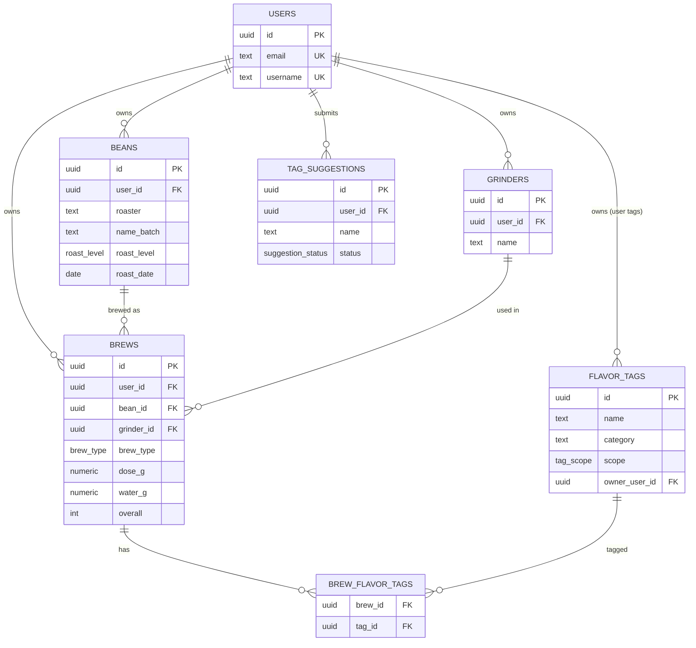

# M1 設計文件 — 資料庫 Schema + 畫面規劃

| 項目 | 內容 |
|---|---|
| 對應 | PRD.md M1（Phase 1 / MVP） |
| 版本 | v0.1（草稿） |
| 最後更新 | 2026-07-08 |
| 狀態 | 待確認 |

> 技術假設：以 **PostgreSQL** 呈現 schema（與 Supabase / Neon 相容），最終技術棧於 M2 定案。DDL 為方言中立寫法，`gen_random_uuid()` 於 Postgres 需 `pgcrypto`／PG13+ 內建。

---

## A. 資料庫 Schema

### A.1 ER 圖



### A.2 列舉型別（Enums）

```sql
create type roast_level        as enum ('light','medium_light','medium','medium_dark','dark');
create type brew_type          as enum ('pour_over','iced_pour_over'); -- 未來 alter type ... add value 'espresso'
create type tag_scope          as enum ('system','user');
create type suggestion_status  as enum ('pending','approved','rejected');
```

> enum 存穩定英文碼，前端對應中文顯示：
> `roast_level` → 淺焙 / 中淺焙 / 中焙 / 中深焙 / 深焙；`brew_type` → 手沖 / 冰手沖。

### A.3 資料表（DDL）

```sql
-- 使用者（若採 Supabase Auth：本表為 profiles，id 對應 auth.users.id）
create table users (
  id         uuid primary key default gen_random_uuid(),
  email      text not null unique,
  username   text not null unique,                 -- 全站唯一，作為「沖煮人」(FR-1.5)
  created_at timestamptz not null default now()
);

-- 磨豆機（刻度綁定此實體，FR-3.9）
create table grinders (
  id         uuid primary key default gen_random_uuid(),
  user_id    uuid not null references users(id) on delete cascade,
  name       text not null,                        -- 例：Comandante C40
  burr_type  text,                                 -- 選填：錐刀 / 平刀
  notes      text,
  created_at timestamptz not null default now(),
  unique (user_id, name)                           -- 同帳號內名稱不重複
);

-- 豆子（一包）
create table beans (
  id          uuid primary key default gen_random_uuid(),
  user_id     uuid not null references users(id) on delete cascade,  -- 建立者
  roaster     text not null,                        -- 烘豆店家 / 品牌
  name_batch  text not null,                        -- 豆名 / 批次
  origin      text not null,                        -- 產地
  varietal    text,                                 -- 品種
  process     text,                                 -- 處理法
  altitude    text,                                 -- 海拔
  farm        text,                                 -- 莊園 / 處理廠
  roast_level roast_level not null,
  roast_date  date not null,                        -- 用於算養豆天數
  agtron      int,                                  -- Phase 2
  notes       text,
  created_at  timestamptz not null default now()
);

-- 風味標籤（系統預設 or 使用者自訂）
create table flavor_tags (
  id            uuid primary key default gen_random_uuid(),
  name          text not null,
  category      text not null,                      -- 花香 / 莓果 / 柑橘 ...
  scope         tag_scope not null default 'user',
  owner_user_id uuid references users(id) on delete cascade,  -- system 時為 null
  created_at    timestamptz not null default now(),
  check ( (scope='system' and owner_user_id is null)
       or (scope='user'   and owner_user_id is not null) )
);
create unique index uq_tag_system on flavor_tags(name)                where scope='system';
create unique index uq_tag_user   on flavor_tags(owner_user_id, name) where scope='user';

-- 提交建議加入內建的標籤（FR-5.6）
create table tag_suggestions (
  id         uuid primary key default gen_random_uuid(),
  user_id    uuid not null references users(id) on delete cascade,
  name       text not null,
  category   text,
  status     suggestion_status not null default 'pending',
  created_at timestamptz not null default now()
);

-- 單次沖煮
create table brews (
  id            uuid primary key default gen_random_uuid(),
  user_id       uuid not null references users(id) on delete cascade,
  bean_id       uuid not null references beans(id) on delete cascade,  -- 刪豆連帶刪沖煮 (FR-2.3)
  brew_type     brew_type not null default 'pour_over',                -- (FR-3.8)
  brewed_at     timestamptz not null default now(),
  -- 器材
  dripper       text,                               -- 濾杯型號
  filter        text,                               -- 濾紙
  grinder_id    uuid references grinders(id) on delete set null,       -- (FR-3.9)
  grind_setting text,                               -- 刻度，綁定 grinder_id 解讀
  kettle        text,                               -- 手沖壺
  -- 沖煮變因
  water_temp    int      check (water_temp between 60 and 100),
  dose_g        numeric(6,2) not null check (dose_g > 0),
  water_g       numeric(6,2) not null check (water_g > 0),
  ice_g         numeric(6,2)          check (ice_g >= 0),
  ratio_include_ice boolean not null default false,  -- 水粉比是否計入冰量 (FR-4.2)
  bloom_water_g numeric(6,2),
  bloom_time_sec int     check (bloom_time_sec >= 0), -- 存秒數 (Q4)
  pour_notes    text,                               -- 注水手法備註
  total_time_sec int     check (total_time_sec >= 0),
  -- 感官 1-5
  aroma         int check (aroma      between 1 and 5),
  acidity       int check (acidity    between 1 and 5),
  sweetness     int check (sweetness  between 1 and 5),
  bitterness    int check (bitterness between 1 and 5),
  body          int check (body       between 1 and 5),
  balance       int check (balance    between 1 and 5),
  aftertaste    int check (aftertaste between 1 and 5),
  overall       int not null check (overall between 1 and 5),  -- 整體喜好度（分析主指標）
  flavor_notes  text,                               -- 風味自由補充
  next_adjustment text,                             -- 下次調整方向
  notes         text,                               -- 自由備註
  created_at    timestamptz not null default now(),
  updated_at    timestamptz not null default now()
);

-- 沖煮 × 風味標籤（多對多）
create table brew_flavor_tags (
  brew_id uuid not null references brews(id)        on delete cascade,
  tag_id  uuid not null references flavor_tags(id)  on delete cascade,
  primary key (brew_id, tag_id)
);
```

### A.4 索引

```sql
create index idx_beans_user      on beans(user_id);
create index idx_brews_user      on brews(user_id);
create index idx_brews_bean      on brews(bean_id);
create index idx_brews_grinder   on brews(grinder_id);
create index idx_brews_brewed_at on brews(brewed_at desc);
create index idx_bft_tag         on brew_flavor_tags(tag_id);
```

### A.5 計算欄位（以 View 提供）

養豆天數與水粉比為衍生值（FR-4），不落地為可編輯欄位，改由檢視表在查詢時計算：

```sql
create view brew_details as
select
  b.*,
  bn.roaster, bn.name_batch, bn.origin, bn.roast_level, bn.roast_date,
  (b.brewed_at::date - bn.roast_date) as rest_days,          -- 養豆天數 (FR-4.1)
  round(
    (b.water_g + case when b.ratio_include_ice
                      then coalesce(b.ice_g,0) else 0 end)
    / b.dose_g
  , 1) as ratio_value                                        -- 前端顯示為 1:{ratio_value} (FR-4.2)
from brews b
join beans bn on bn.id = b.bean_id;
```

### A.6 權限（Row Level Security 概念）

以「資料預設私有、後端強制」為原則（NFR）。若採 Supabase，各表啟用 RLS：

| 表 | 讀取 | 寫入 |
|---|---|---|
| beans / brews / grinders / tag_suggestions | `user_id = auth.uid()` | `user_id = auth.uid()` |
| flavor_tags | `scope='system' OR owner_user_id = auth.uid()` | 僅能新增 / 改 / 刪自己的（`owner_user_id=auth.uid()`）；system 由管理者維護 |
| brew_flavor_tags | 透過所屬 brew 的擁有者判定 | 同左 |

> Phase 2「分享」時再加公開讀取的 policy（如 `is_public = true`）。

### A.7 種子資料（Seed）

- `flavor_tags`：依 PRD §8 匯入 system 標籤（scope='system'）。
- enum 值如上；`brew_type` 未來以 `alter type brew_type add value 'espresso'` 擴充。

---

## B. 畫面規劃

### B.1 資訊架構與導覽（桌面優先）

左側側邊欄（桌面）／頂部收合選單（手機）：

```
┌───────────┐
│  ☕ Brewlog │
├───────────┤
│ ▸ 首頁      │  Dashboard
│ ▸ 沖煮      │  Brews（列表 / 新增 / 詳情）
│ ▸ 豆子      │  Beans（列表 / 詳情）
│ ▸ 分析      │  Analytics
│ ▸ 設定      │  Settings（磨豆機 / 我的標籤 / 匯出）
├───────────┤
│ 👤 使用者   │  帳號 / 登出
└───────────┘
```

### B.2 頁面清單

| # | 頁面 | 用途 | 主要對應 FR |
|---|---|---|---|
| P1 | 登入 / 註冊 | 認證、設定使用者名稱 | FR-1 |
| P2 | 首頁 Dashboard | 最近沖煮、關鍵統計、快速「新增沖煮」 | FR-3, FR-6 |
| P3 | 沖煮列表 | 多條件篩選 / 排序 / 搜尋 | FR-3, FR-7 |
| P4 | 沖煮詳情 | 完整參數、感官雷達、複製為新紀錄 | FR-3.6, FR-6 |
| P5 | 沖煮表單（新增 / 編輯） | 記錄一次沖煮，含自動計算、標籤 | FR-3, FR-4, FR-5 |
| P6 | 豆子列表 | 豆子總覽 / 篩選 | FR-2, FR-7 |
| P7 | 豆子詳情 | 豆子履歷 + 其所有沖煮 + 同支豆比較 | FR-2, FR-6(A1) |
| P8 | 豆子表單（新增 / 編輯） | 維護一包豆 | FR-2 |
| P9 | 分析頁 | A2 散點 / A3 適飲窗口 / A4 標籤 / A5 雷達 | FR-6 |
| P10 | 設定 | 使用者名稱、磨豆機管理、我的標籤 / 提交、CSV 匯出 | FR-1, FR-3.10, FR-5, FR-8 |

### B.3 關鍵頁面 Wireframe

#### P5 沖煮表單（分段、進階可折疊，附「複製上一杯」）

```
┌────────────────────────────────────────────────────────────┐
│  新增沖煮                                   [複製上一杯] [儲存] │
├────────────────────────────────────────────────────────────┤
│ 基本                                                          │
│  豆子 [ Ethiopia Guji ▾ ] [＋新增豆子]   類型 [手沖 ▾]         │
│  日期時間 [2026-07-08 09:30]     養豆天數：12 天（自動）        │
├────────────────────────────────────────────────────────────┤
│ 器材                                                          │
│  濾杯 [V60 ▾]  濾紙 [Cafec 漂白]  手沖壺 [Fellow Stagg]        │
│  磨豆機 [Comandante C40 ▾]  刻度 [22 clicks]                  │
├────────────────────────────────────────────────────────────┤
│ 沖煮變因                                                      │
│  水溫 [92]℃  粉量 [15]g  水量 [240]g  冰量 [__]g              │
│  水粉比：1:16.0（自動）  ☐ 計入冰量                            │
│  悶蒸水量 [30]g  悶蒸時間 [0:30]  總時間 [2:30]               │
│  注水手法備註 [ 三段注水，中心繞圈… ]                          │
├────────────────────────────────────────────────────────────┤
│ 感官評分（1–5）                                               │
│  香氣 ●●●●○  酸質 ●●●○○  甜感 ●●●●○  苦味 ●●○○○             │
│  口感 ●●●○○  平衡 ●●●●○  餘韻 ●●●○○                          │
│  風味標籤 [藍莓 ✕][柑橘 ✕][紅茶 ✕]  [＋ 輸入/選擇…]           │
│  風味自由補充 [ … ]                                           │
├────────────────────────────────────────────────────────────┤
│ 結論                                                          │
│  整體喜好度 ★★★★☆   下次調整方向 [ 刻度再細一點 ]             │
│  自由備註 [ … ]                                              │
└────────────────────────────────────────────────────────────┘
```

#### P3 沖煮列表（篩選 + 表格）

```
┌────────────────────────────────────────────────────────────┐
│  沖煮紀錄                                       [＋ 新增沖煮]  │
│  🔍[搜尋豆名/店家/備註]  豆子[全部▾] 產地[▾] 處理法[▾]        │
│  焙度[▾] 濾杯[▾] 喜好度[≥4▾] 標籤[▾] 日期[起—迄]  [重設]      │
├──────┬──────────────┬────┬────┬──────┬──────┬──────┬───────┤
│ 日期 │ 豆子          │焙度│水溫│粉水比 │養豆  │喜好度│ 標籤  │
├──────┼──────────────┼────┼────┼──────┼──────┼──────┼───────┤
│07-08 │Ethiopia Guji │中淺│92  │1:16.0│12天  │★★★★☆│藍莓…  │
│07-06 │Colombia Geisha│淺 │90  │1:15.0│ 9天  │★★★★★│花香…  │
│ …    │              │    │    │      │      │      │       │
└──────┴──────────────┴────┴────┴──────┴──────┴──────┴───────┘
       欄位可排序（日期 / 喜好度…）    列可點入詳情 (P4)
```

#### P7 豆子詳情（履歷 + 同支豆比較 A1）

```
┌────────────────────────────────────────────────────────────┐
│  Ethiopia Guji  ·  某某烘豆所           [編輯] [刪除⚠]        │
│  產地 Guji｜品種 Heirloom｜處理法 水洗｜焙度 中淺｜烘焙 06-26  │
├────────────────────────────────────────────────────────────┤
│  這包豆的沖煮（8 筆）                        [＋ 用這包沖煮]   │
│  ┌ 養豆 vs 喜好度 ─────────────────┐  最佳：07-08 ★★★★☆      │
│  │      ★                          │  刻度22 / 92℃ / 1:16   │
│  │   ★     ★   ★                   │                        │
│  │ ★           ★  ★                │                        │
│  └─養豆天數 5   10   15────────────┘                        │
│  ┌────┬────┬────┬──────┬──────┬──────┐                      │
│  │日期│刻度│水溫│粉水比 │養豆  │喜好度│  ← 並列比較變因       │
│  ├────┼────┼────┼──────┼──────┼──────┤                      │
│  │07-08│22 │92  │1:16.0│12天  │★★★★☆│                      │
│  │07-01│24 │90  │1:15.0│ 5天  │★★★☆☆│                      │
│  └────┴────┴────┴──────┴──────┴──────┘                      │
└────────────────────────────────────────────────────────────┘
```

#### P9 分析頁

```
┌────────────────────────────────────────────────────────────┐
│  分析        篩選：豆子[全部▾] 產地[▾] 焙度[▾] 日期[起—迄]    │
├───────────────────────────────┬────────────────────────────┤
│ A2 喜好度 vs 變因              │ A3 適飲窗口（養豆 vs 喜好度）│
│  X軸[刻度▾]  (散點圖)          │  (折線 / 散點)              │
│                               │                            │
├───────────────────────────────┼────────────────────────────┤
│ A4 風味標籤統計                │ A5 感官雷達（可疊多筆）      │
│  藍莓 ████████ 12 · avg4.3    │      香氣                   │
│  柑橘 ██████   9 · avg4.0     │   餘韻 ◇ 酸質               │
│  花香 ████     6 · avg4.5     │   平衡 ◇◇ 甜感              │
│  …                            │      口感 苦味              │
└───────────────────────────────┴────────────────────────────┘
```

#### P10 設定 — 磨豆機管理 + 刪除豆子確認（type-to-confirm, FR-2.3）

```
設定 › 磨豆機                          刪除豆子確認 ⚠
┌───────────────────────┐            ┌──────────────────────────────┐
│ Comandante C40  [編輯] │            │ 這將永久刪除「Ethiopia Guji」 │
│ 1Zpresso K-Ultra[編輯] │            │ 及其 8 筆沖煮紀錄，無法復原。 │
│ [＋ 新增磨豆機]        │            │ 請輸入豆名以確認：            │
└───────────────────────┘            │ [ ____________________ ]     │
設定 › 我的標籤                        │            [取消] [刪除]      │
  自訂：焦糖布丁 ✕ · 龍眼 ✕           └──────────────────────────────┘
  [＋ 新增自訂標籤]  [提交建議加入內建]
設定 › 資料
  [匯出 CSV]
```

### B.4 元件與互動備註

- **評分輸入**：1–5 用點/星點擊；桌面可鍵盤 1–5。
- **風味標籤**：可搜尋的多選 combobox；輸入不存在的字可「建立為自訂標籤」；旁附「提交建議加入內建」。
- **水粉比 / 養豆天數**：即時前端計算顯示（唯讀），與後端 view 一致。
- **複製上一杯 / 複製為新紀錄**：帶入除日期時間外的所有欄位，日期改為當下。
- **時間欄位**：輸入接受 `m:ss` 或秒數，儲存為秒。
- **刪除豆子**：type-to-confirm，且顯示連帶刪除的沖煮筆數。
- **響應式**：桌面表格 → 手機改為卡片列表；表單分段在手機為可折疊區塊。

---

## B.5 實作後記（2026-07-14 回寫：與 §A/§B 原設計的增補）

Schema 演進（單一事實來源＝`supabase/migrations/`，此處僅摘要）：

| 增補 | 說明 |
|---|---|
| `users` → `profiles` | Supabase 慣例；id 直接對應 auth.users.id、不存 email；username 以 lower() unique index 大小寫不敏感唯一 |
| `equipment` | 濾杯/濾紙/手沖壺選項清單（enum kind）；沖煮紀錄仍存文字非 FK |
| `groups` / `group_members` | FR-10：邀請碼、建立者權限；beans/grinders/equipment 各加 nullable `group_id` |
| `flavor_tags.scope` | 加 `group`：群組標籤（建立者審核 tag_suggestions 後產生，FR-5.6 改版） |
| `brew_pours` | FR-11 注水分段（seq、end_time_sec、cumulative_water_g、note） |
| `brew_details` view | 增加 `varietal`、`process`、`group_id`、`brewer_username`（left join profiles）；rest_days 以 Asia/Taipei 取日 |
| GRANT | 新版 Supabase 映像不再預設授予 DML，明確 GRANT＋default privileges（migration 0009） |
| security definer helpers | `is_group_member` / `shares_group_with` / `tag_on_visible_brew`（打斷政策遞迴） |

畫面/互動與 §B 原設計的差異：
- 時間輸入：分/秒下拉（非文字輸入），選填欄位附清除鈕。
- 處理法/器材/磨豆機名稱：下拉＋可自填（ComboboxInput），內建常用清單（`lib/presets.ts`）。
- P5 新增「注水分段」動態列區塊；P4 以時間軸顯示。
- P9 篩選＝P3 全套九條件＋「只看我的/含群組成員」切換（FR-10.7）。
- P10 新增：群組管理（含標籤審核佇列）、我的器材。
- 必填漏填：欄位紅框＋toast 彙總提醒＋自動聚焦第一個錯誤欄位。

## C. 下一步

1. 你確認本 Schema 與畫面規劃（或指出要調整處）。
2. 進入 **M2 技術選型**（含成本），定案技術棧與部署。
3. 之後 **M3** 依此開始建置。

> 開放小點：P2 首頁的「關鍵統計」要放哪些指標（例：本月沖煮數、平均喜好度、最常用豆子）？可於確認時一併決定。
